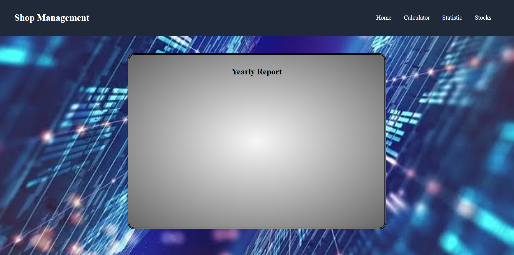
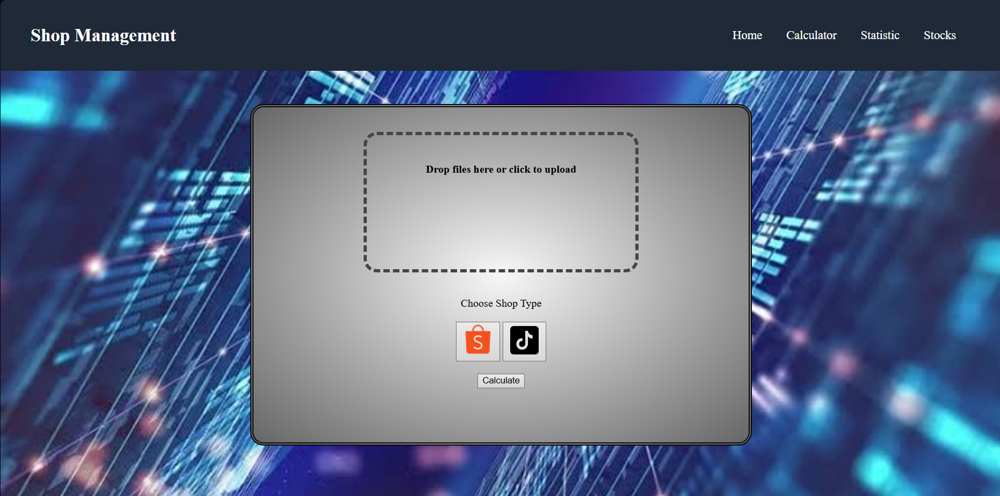
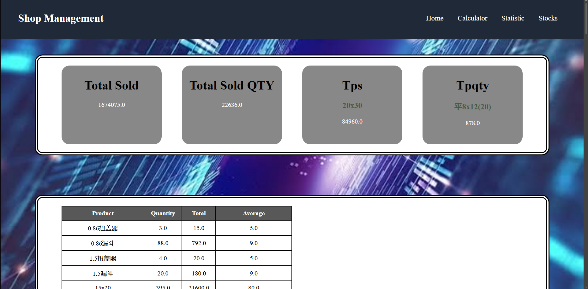
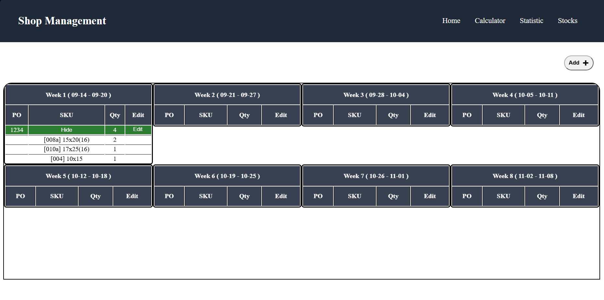
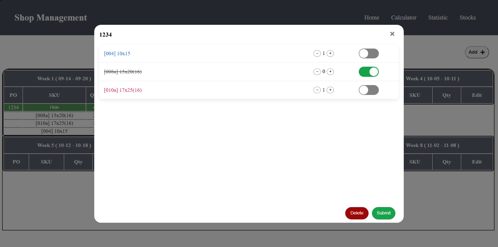

# Shop Management System

A full-stack business management web application built for my family's business using Flask, SQLite, HTML, CSS, and JavaScript.

The system helps manage inventory, purchase orders, sales calculations, and business statistics through a simple web interface, replacing manual spreadsheets and making daily operations more efficient.

---

## Features

### Inventory Management
- Track shipment quantities
- View upcoming shipment by weeks

### Purchase Order Management
- Create purchase orders
- Edit existing orders
- Track logistics status
- Expand and collapse order details
- Group products under a single PO

### Sales Calculator
- Upload Excel reports
- Process sales data automatically

### Statistics Dashboard (Future)
- View business performance
- Analyze sales information
- Display inventory related data

### UI friendly
- Desktop support
- Mobile friendly

---

## Screenshots

### Home Page



### Calculator





### Stock Management



### Purchase Order Editor



---

## Tech Stack

### Backend
- Python
- Flask
- SQLite

### Frontend
- HTML
- CSS
- JavaScript

### Tools
- Git
- GitHub
- Render

---

## Project Structure

```text
Shop-management-system/
│
├── static/
│   ├── home.css
│   ├── stock.css
|   ├── result.css
│   ├── calculator.css
│   └── images/
│
├── templates/
│   ├── home.html
│   ├── stocks.html
│   ├── cal.html
│   ├── result.html
│   └── stat.html
│
├── app.py
├── requirement.txt
├── stocks.db
└── README.md
```

---

## Why I Built This

I created this project to help manage my family's business operations.

Previously, inventory and purchase orders were handled manually, making it difficult to keep track of stock and order information. This system centralizes inventory management, purchase orders, sales calculations, and reporting into a single platform.

The project also allowed me to gain practical experience in:

- Developing website
- HTML, JS, CSS, and DB experiences
- Learn new python libraries(times, csv, flask)

---

## Future Improvements

- Security and login system
- Excel export functionality
- Analysis system
- Data chart

---

## Author

**Max Lee**

GitHub: https://github.com/maxlee356271-rgb
